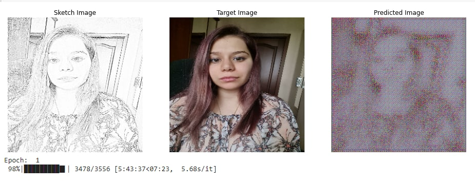

# pix2pix_cv_mipt_2022
Repo of CV semester project by Julia SMolkina

Я использую модель pix2pix, Для обучеия использовалось 3 датасета (аниме,CHUNK. celebA). Валидация тже проходила на этих датасетах, а также на моей фотографии ( предварительно были сгенерированы скетчи недостоющим картинкам)

Особенностью данной реализации, можно считать, что на вход попадают сдвоенные картинки (фото+скетч), поэтому я дописала часть которая соединяет картинки вместе. Также из-за того, что выши картинки могут лежать в разных папках была дописана часть сопоставляющая картинки из разных репозиторие с одинаковым паттерном в имен ( например f-011-5.jpg и f2-011-5.jpg). В коде также есть генератор скетчей.

# Некоторые результаты
 
Как видно  обучение и валидация датасета с аниме прошла более, чем успешно, однако обучение в Google colab для 3х эпох занимает около 20 часов.

Теперь, посмотрим на то как все сработало с CHUNK датасет (лица студентов из Гонконга в основном азиаты)
 
Как видно  обучение и валидация датасета с аниме прошла более ли менее, обучение шло 100 эпох. Тем ни менее результаты не полностью удовлетворительные.

### Возможные причины

Я не корректировала размер скетча при слиянии картинок и сам датасет совсем небольшой.

Теперь, я после обучения на Гонконгском датасете запустила свое лицо (европейская внешность), надо признаться результат получился ниже среднего

Моя фотография и скетч 

Для валидации после обучения на аниме датасете:

