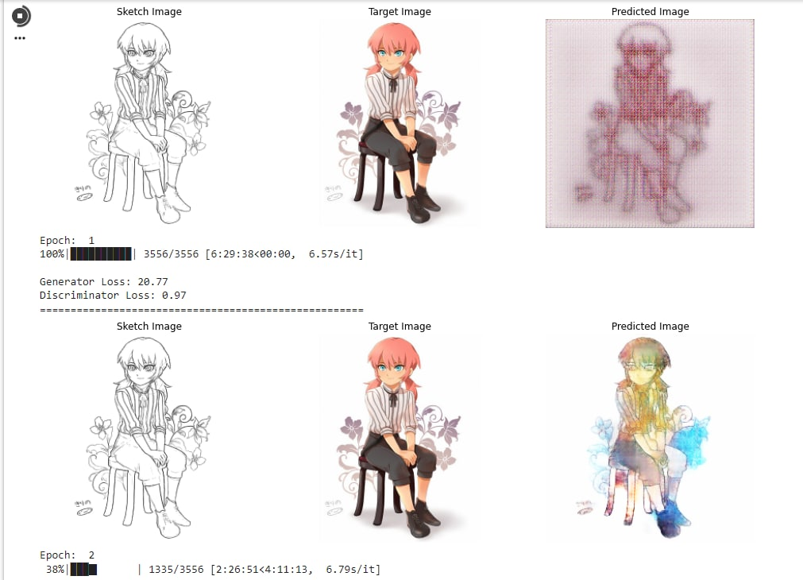
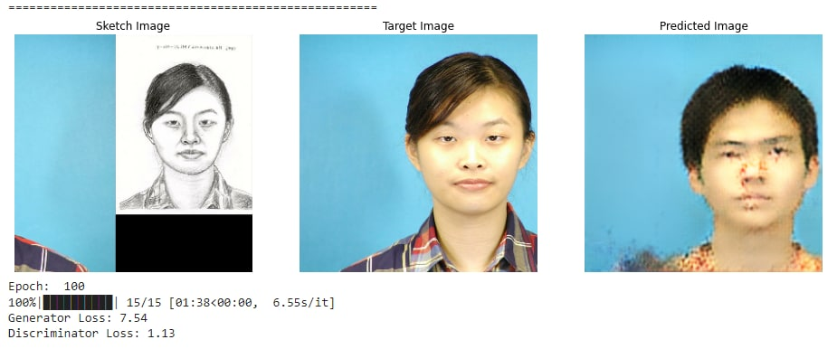
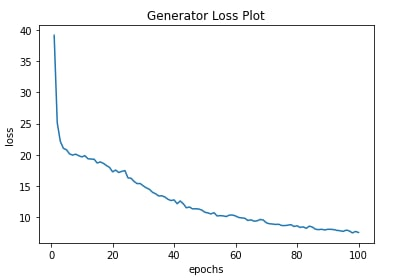
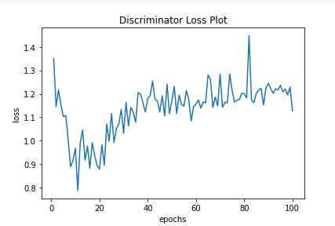
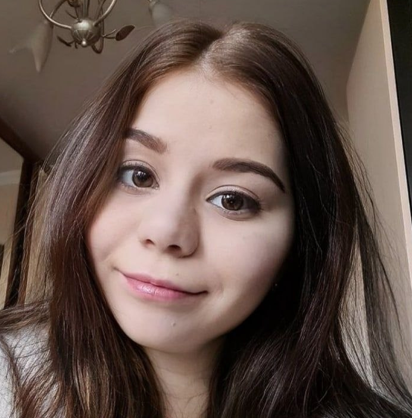
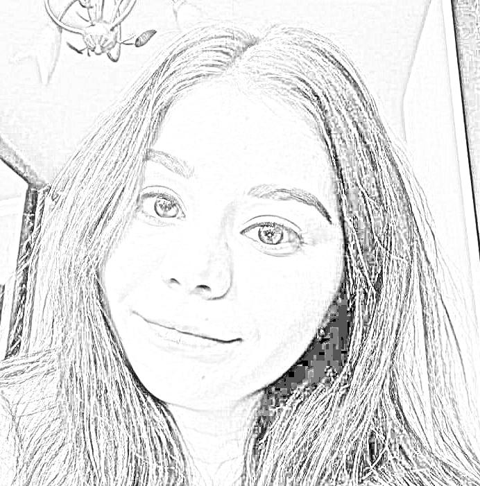

# pix2pix_cv_mipt_2022
Repo of CV semester project by Julia SMolkina

Я использую модель pix2pix, Для обучеия использовалось 3 датасета (аниме,CHUNK. celebA). Валидация тже проходила на этих датасетах, а также на моей фотографии ( предварительно были сгенерированы скетчи недостоющим картинкам)

Особенностью данной реализации, можно считать, что на вход попадают сдвоенные картинки (фото+скетч), поэтому я дописала часть которая соединяет картинки вместе. Также из-за того, что выши картинки могут лежать в разных папках была дописана часть сопоставляющая картинки из разных репозиторие с одинаковым паттерном в имен ( например f-011-5.jpg и f2-011-5.jpg). В коде также есть генератор скетчей.

ГЕНЕРАТОР СТЕЧЕЙ - def img2skt(img_path, rez_path)

    
# Некоторые результаты
 
Как видно  обучение и валидация датасета с аниме прошла более, чем успешно, однако обучение в Google colab для 3х эпох занимает около 20 часов.

Теперь, посмотрим на то как все сработало с CHUNK датасет (лица студентов из Гонконга в основном азиаты)
 

Как видно  обучение и валидация датасета с аниме прошла более ли менее, обучение шло 100 эпох. Тем ни менее результаты не полностью удовлетворительные.

 
 

### Возможные причины

Я не корректировала размер скетча при слиянии картинок и сам датасет совсем небольшой.

Теперь, я после обучения на Гонконгском датасете запустила свое лицо (европейская внешность), надо признаться результат получился ниже среднего

Моя фотография и скетч 

Для валидации после обучения на аниме датасете:

![Картинка5 -юля после обучения]
(https://github.com/SmolkinaJulia/pix2pix_cv_mipt_2022/blob/2d89444d7a44fcdbbc2110d8734cc97b13397961/%D1%8E%D0%BB%D1%8F%20%D0%BF%D0%BE%D1%81%D0%BB%D0%B5%20%D0%BE%D0%B1%D1%83%D1%87%D0%B5%D0%BD%D0%B8%D1%8F%20%D0%BD%D0%B0%20%D0%B0%D0%BD%D0%B8%D0%BC%D0%B5.jpg)

## Можно сравнить результаты двух похожих алгоритмов Sketch2faсe и Pix2pixHD

